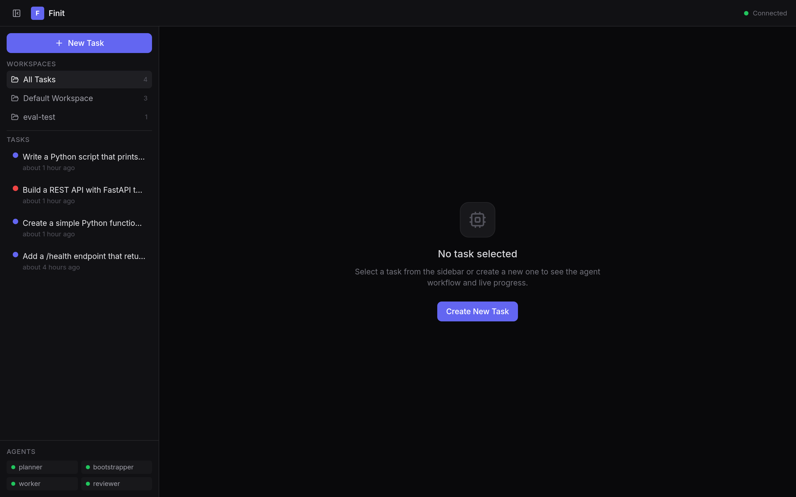
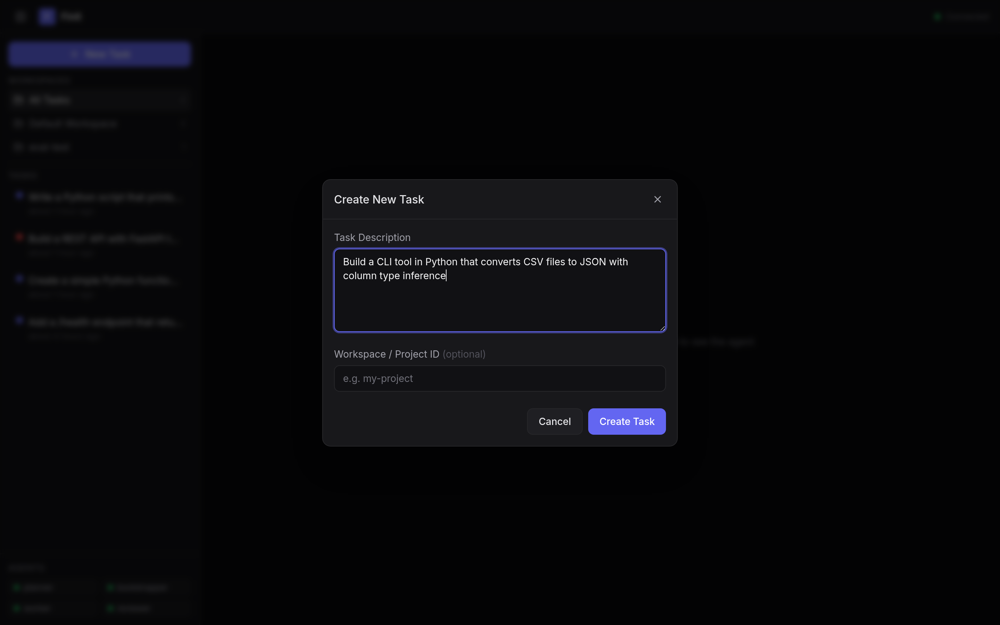
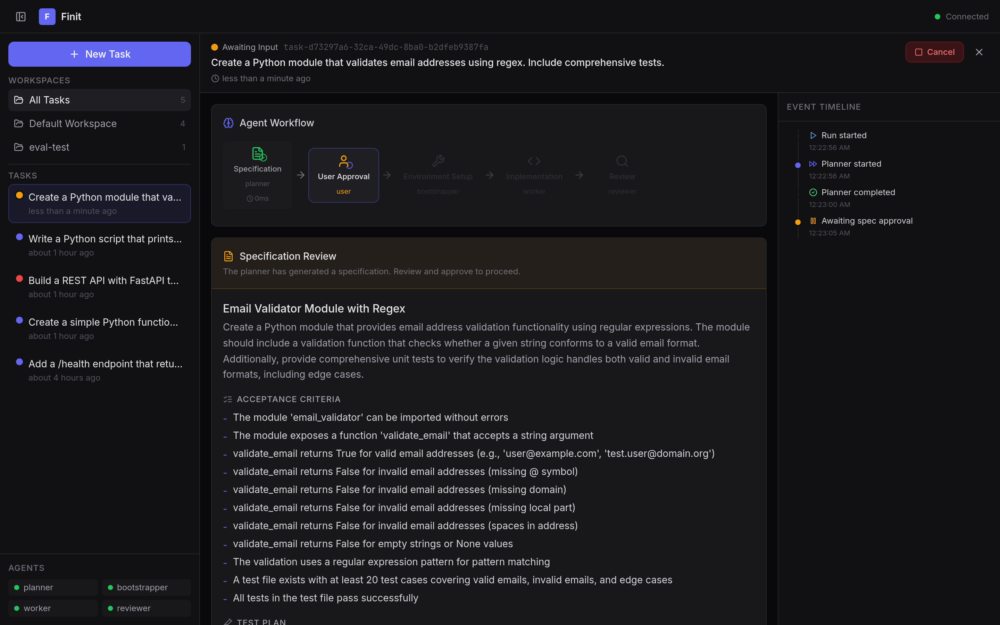
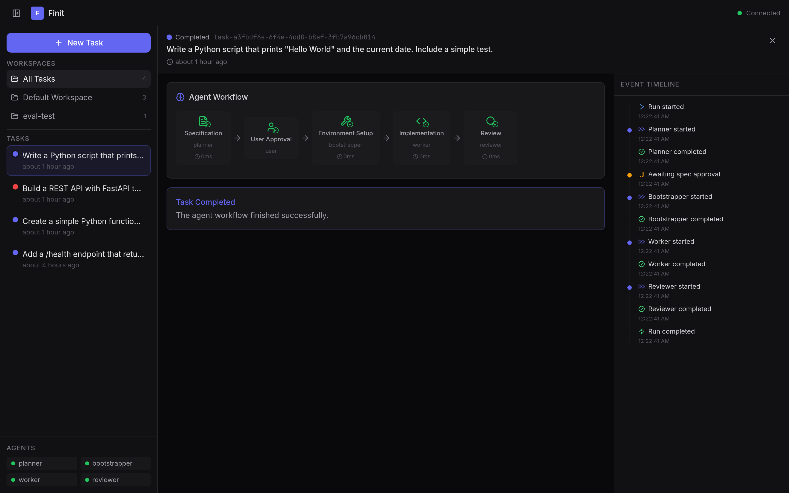
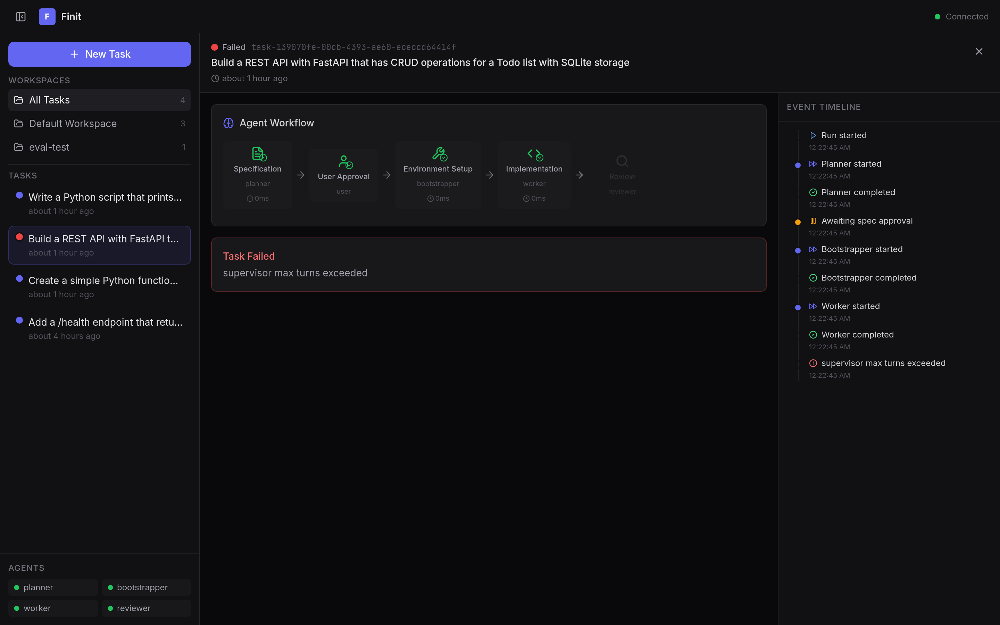
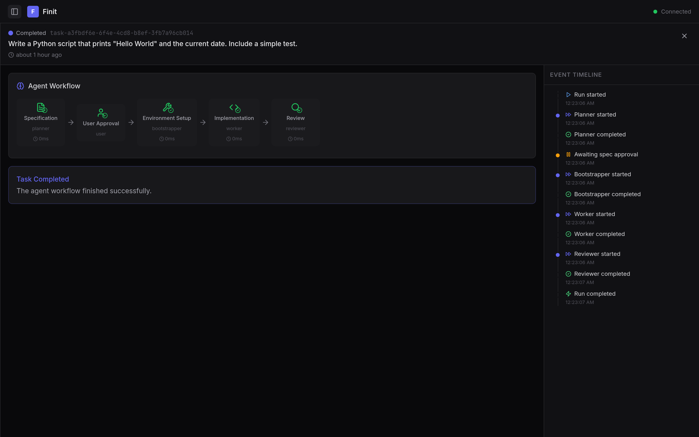

# Finit - Environment-Aware Autonomous Development Agent

## Что такое Finit?

Finit - агентная платформа для автономной разработки ПО в режиме **Polished YOLO**. Пользователь описывает задачу, система самостоятельно готовит окружение, пишет код, тестирует и ревьюит результат. Взаимодействие с пользователем - только на чекпоинтах: одобрение спецификации и выдача разрешений.

### Проблема

Кодинг-агенты ломаются, когда сталкиваются с пробелами в окружении: отсутствует CLI-инструмент, неправильная версия рантайма, недоступный API, нет MCP-сервера. Агент не может это исправить - он либо спрашивает пользователя (ломая поток), либо повторяет нерабочий подход в цикле.

**Глубинная проблема:** агенты воспринимают своё окружение как данность. Они не анализируют *почему* не могут решить задачу и не могут расширить свои возможности.

### Ключевая инновация: Env-Aware Agent

Агент Finit **управляет и развивает собственный инструментарий**:

- Определяет, какие инструменты, рантаймы, зависимости и MCP-серверы нужны
- Ищет подходящие инструменты (web search) и оценивает: разовая задача → библиотека, повторяющийся workflow → MCP-сервер
- Устанавливает недостающее, регистрирует MCP-серверы для повторного использования другими агентами
- Учится на задачах через долгосрочную память (правила, факты)

## Архитектура

```
User → WebUI → Orchestrator
                    │
                    ├── Supervisor Agent (LLM-driven, 13 platform tools)
                    │       │
                    │       ├── dispatch_agent(planner)      → спецификация
                    │       ├── request_user_approval()       → одобрение
                    │       ├── dispatch_agent(bootstrapper)  → окружение
                    │       ├── dispatch_agent(worker)        → код + тесты
                    │       ├── dispatch_agent(reviewer)      → ревью
                    │       └── complete_task() / fail_task()
                    │
                    ├── LLM Router (Pingora)
                    │       ├── Auth, Budget, Guardrails
                    │       ├── Cache (SHA256 exact-match)
                    │       ├── Circuit breaker + failover
                    │       └── Usage logging (llm_usage)
                    │
                    └── PostgreSQL (pgvector)
                            ├── tasks, specs, artifacts, reviews
                            ├── memory_rules, memory_facts
                            ├── llm_usage, llm_cache
                            └── agents, workspaces
```

### Агенты

| Агент | Тип | Описание |
|-------|-----|----------|
| **Supervisor** | Tool-calling LLM | Управляет жизненным циклом задачи через 13 платформенных инструментов. Решения принимает LLM, не захардкоженная логика. |
| **Planner** | Schema-guided | Генерирует спецификацию: title, acceptance_criteria, test_plan. 5 стадий рассуждения. |
| **Bootstrapper** | Tool-calling LLM | Определяет окружение. Ищет MCP-серверы для повторяемых интеграций, устанавливает библиотеки для разовых задач. |
| **Worker** | Tool-calling LLM | Пишет код через tool loop: read_file → write_file → run_command → iterate. До 15 итераций. |
| **Reviewer** | Schema-guided | Оценивает артефакты строго по acceptance criteria. Verdict: PASS/FAIL с findings и evidence. |

### Протоколы

- **A2A** (JSON-RPC 2.0) - inter-agent коммуникация, agent card discovery
- **AG-UI** (SSE) - real-time события в WebUI (RUN_STARTED, STEP_FINISHED, RUN_AWAITING_INPUT, etc.)
- **OpenAI-compatible** - все LLM-вызовы через единый LLM Router

### Web UI

Веб-интерфейс для создания задач, просмотра пайплайна в реальном времени (SSE), согласования спецификаций и мониторинга агентов.

| Dashboard | Create Task |
|-----------|------------|
|  |  |

| Spec Approval | Task Completed |
|---------------|----------------|
|  |  |

| Task Failed | Collapsed Sidebar |
|-------------|-------------------|
|  |  |

## Результаты оценки

**19/20 тестов пройдено** на MiniMax M2.7 (sglang). 1 timeout (инфра, не логика). Подробности: [docs/eval-results.md](docs/eval-results.md).

| Уровень | Тесты | Результат | Что проверяется |
|---------|-------|-----------|----------------|
| L0 Smoke | 4 | 4/4 | Доступность LLM, детекция языков |
| L4 Pipeline + Judge | 2 | 2/2 | plan→boot→work→review, LLM-as-a-Judge (5 измерений) |
| L5 Env Challenge | 4 | 3/4 | pyproject.toml, Django, missing Go deps, TypeScript (1 timeout) |
| L6 Continuous | 2 | 2/2 | Многозадачность: Python health→metrics, Go healthz→readyz |
| L7 Rule Compliance | 3 | 3/3 | Запретные файлы, print()→logging, docstrings |
| L8 Complex Env | 3 | 3/3 | Рефакторинг auth middleware, монорепо, tap test runner |
| L9 MCP Discovery | 2 | 2/2 | OpenSearch (pip fallback), GitHub multi-repo triage |

### LLM-as-a-Judge

Двухуровневая верификация результатов:

1. **Статические проверки**: артефакты созданы, тесты прошли, правильный язык, запретные паттерны отсутствуют
2. **LLM Judge** (5 измерений × 0-5 баллов): correctness, code_quality, test_quality, environment_fit, rule_compliance

L7 rule compliance: все 3 теста - **100%** (статика + LLM judge 25/25).

### Supervisor Agent

LLM-driven агент, управляющий задачей через tool calls. Пример реального прогона:

```
turn 0:  get_task                       → прочитал задачу
turn 1:  dispatch_agent(planner)        → спецификация
turn 2:  save_spec                      → сохранил
turn 3:  request_user_approval          → пользователь одобрил
turn 4:  get_budget                     → проверил бюджет
turn 5:  dispatch_agent(bootstrapper)   → окружение
turn 6:  dispatch_agent(worker)         → код (3 файла, 8 команд)
turn 7:  store_artifacts
turn 8:  dispatch_agent(reviewer)       → FAIL, 3 замечания
turn 9:  dispatch_agent(worker)         → повтор с фидбеком
turn 12: dispatch_agent(reviewer)       → PASS
turn 14: complete_task                  → готово (~2.5 мин)
```

### MCP Discovery

Bootstrapper ищет MCP-серверы для внешних сервисов перед установкой библиотек:

```
turn 0: web_search("opensearch MCP server")  → поиск MCP
turn 1: install_package("pip", "opensearch-py")  → fallback на библиотеку
```

Для GitHub: нашёл `@modelcontextprotocol/server-github`, но выбрал PyGithub - API хорошо известен. MCP-путь зарезервирован для сложных/незнакомых интеграций.

## Быстрый старт

```bash
# 1. Клонировать и настроить
cp .env.example .env  # настроить JWT_SECRET, PG_PASSWORD

# 2. Поднять eval-стек (все сервисы на host network)
docker compose -f docker-compose.eval.yml up -d

# 3. Зарегистрировать агентов
for p in 9000 9001 9002 9003; do
  curl -s -X POST http://localhost:8080/api/agents \
    -H "Content-Type: application/json" \
    -d "{\"url\": \"http://localhost:$p\"}"
done

# 4. Создать задачу
curl -X POST http://localhost:8080/api/tasks \
  -H "Content-Type: application/json" \
  -d '{"input": "Add a /health endpoint returning JSON status to a Python Flask app"}'

# 5. Запустить eval
cd evals && JWT_SECRET=dev-secret pytest test_smoke_llm.py test_rule_compliance.py \
  test_judged_pipeline.py test_env_challenge.py test_complex_env.py \
  test_continuous.py -v --timeout=300
```

## Структура проекта

```
orchestrator/          Rust (Axum) - supervisor agent, task API, AG-UI SSE
llm-router/            Rust (Pingora) - LLM proxy, cache, guardrails, budget
agents/
  shared/finit_agent/  Python - A2A protocol, LLM client, Pydantic schemas
  planner/             Python - спецификация задачи
  bootstrapper/        Python - env detection, MCP discovery, tool installation
  worker/              Python - tool-calling code generation
  reviewer/            Python - evidence-based ревью
webui/                 React/TypeScript - real-time dashboard
evals/
  fixtures/            Генераторы проектов (Python, Go, Node, Rust - 14 вариантов)
  judge.py             LLM-as-a-Judge + static checks
  dataset.py           29 eval-кейсов по 9 уровням (L1-L9)
  test_*.py            Тестовые файлы по уровням
prompts/               Системные промпты всех агентов (загружаются из файлов)
migrations/            PostgreSQL schema (pgvector)
config/                Router YAML, Prometheus, OTel, alerts
```

## Документация

- [Системный дизайн](docs/system-design.md) - архитектура, ADR, протоколы
- [Результаты оценки](docs/eval-results.md) - полные результаты eval с метриками
- [Спецификация памяти](docs/specs/memory-context.md) - правила, факты, семантический поиск
- [Observability](docs/specs/observability.md) - OpenTelemetry, Prometheus, метрики
- [Serving конфигурация](docs/specs/serving-config.md) - Docker Compose, окружения

## Out of Scope (PoC)

- Мультитенантный / облачный деплой - только один пользователь, локально
- Долгосрочное управление проектом - нет бэклога, нет кросс-задачных зависимостей
- gVisor-песочница - PoC использует Docker volumes, не микро-VM
