# Finit Platform — Architectural Specification

## Goals

- Build an environment-aware autonomous development agent platform where agents own and manage their execution environment, autonomously acquiring missing tools and dependencies within isolated sandboxes
- Provide a compiled Rust core runtime that never requires recompilation when agents are added, removed, or updated
- Enable language-agnostic agent extensibility via multi-protocol support (A2A, ACP, MCP) — agents are pluggable HTTP services written in any language, using any supported agent protocol
- Unify all inter-agent knowledge sharing through the Cortex — a typed fragment store with semantic search, interest-based subscriptions, and cascading action resolution
- Implement human-in-the-loop as a generalized fragment cascade where agents resolve each other's needs before escalating to the user
- Enforce hardware-level isolation between agents via platform-adaptive OCI sandboxing — Firecracker/Kata on Linux, Apple Virtualization.framework on macOS, Docker as universal fallback
- Protect secrets from LLM exposure through a Vault-backed firewall that blocks prompts containing sensitive values

## Requirements

### Non-Functional Requirements

- **Isolation**: Agent crash must not propagate. Hardware-enforced via hypervisor (KVM on Linux, Virtualization.framework on macOS) with dedicated kernel per agent. Recovery < 5s.
- **Extensibility**: New agent from implementation to running instance in < 1 hour. Zero core code changes. Any programming language. Any supported protocol (A2A, ACP, MCP).
- **Latency**: Cortex structured query < 50ms. Semantic search < 200ms. Agent protocol message round-trip < 100ms on localhost.
- **Auditability**: Every fragment mutation, tool invocation, and state transition logged with task ID, timestamp, and agent ID. Replayable from logs.
- **Resource control**: Per-agent CPU, memory, PID limits enforced by cgroups/hypervisor. Configurable per agent manifest.
- **Cross-platform**: Core runtime and isolation layer work on Linux (x86_64, aarch64) and macOS (Apple Silicon). Same OCI container images run on both.
- **Security**: LLM Firewall blocks all prompts containing known secret values. Vault-scoped secret injection. Deny-by-default network in sandboxes.
- **Token efficiency**: Coordinator prompt size O(1) regardless of agent count. Semantic tool discovery replaces broadcast. Artifacts stored by reference, not inline.
- **Single machine**: All components run on one host (32GB+ RAM, GPU for inference). No distributed consensus required.

### Functional Requirements

- Agents declare capabilities and callable functions via protocol-specific manifests (A2A Agent Cards, ACP agent manifests, MCP tool lists) — normalized into Cortex fragments on registration
- Coordinator discovers and invokes agents via LLM-native tool calling with semantic search, protocol-agnostic
- Cortex stores typed knowledge fragments with publish, subscribe, query, and semantic search operations
- Artifacts stored in S3-compatible storage; only `ArtifactRef` references passed between agents
- `action_needed` fragments enable cascading resolution — agents attempt resolution first, user is the subscriber of last resort
- Secrets managed by HashiCorp Vault; injected as environment variables into agent sandboxes, never into LLM prompts
- Agent lifecycle managed by Supervisor: start in OCI sandbox (platform-adaptive isolation), health check, restart, graceful shutdown
- MCP integration for dynamic tool extensibility within agent sandboxes
- Existing agent ecosystems mountable: Claude Code (via Agent SDK wrapper), OpenHands (via A2A adapter), BeeAI agents (via ACP adapter), any MCP tool server

## Solution Overview

Finit is an environment-aware autonomous development agent platform. Its core innovation is that agents own their execution environment — they analyze task requirements, identify capability gaps, and autonomously acquire missing tools within isolated sandboxes before development begins. See `product-proposal.md` for detailed motivation and use cases.

The platform consists of a **Core Runtime** (a single compiled Rust binary) and a fleet of **Agents** (opaque HTTP services in any language communicating via A2A, ACP, or MCP protocols). The core provides seven facilities: the **Cortex** (typed knowledge store with semantic search), the **Tool Bridge** (translates LLM tool calls into protocol-specific agent invocations), the **Protocol Adapters** (A2A, ACP, and MCP normalized into a common internal representation), the **Artifact Store** (S3-backed large object storage), the **Vault Client** (scoped secret management with LLM firewall), the **Cascade Manager** (tracks `action_needed` resolution lifecycle), and the **Supervisor** (platform-adaptive OCI sandbox lifecycle management).

The core is closed for modification and open for extension. Adding a new agent means deploying an HTTP service that speaks any supported protocol and registering it. No core recompilation, no configuration changes, no restarts. The Cortex automatically indexes the new agent's capabilities and tool definitions, making them discoverable via semantic search. Existing agent ecosystems — Claude Code, OpenHands, BeeAI, any MCP server — can be mounted as Finit agents through protocol adapters.

### System Context

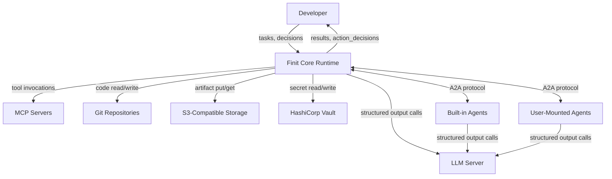

### Core Runtime Architecture

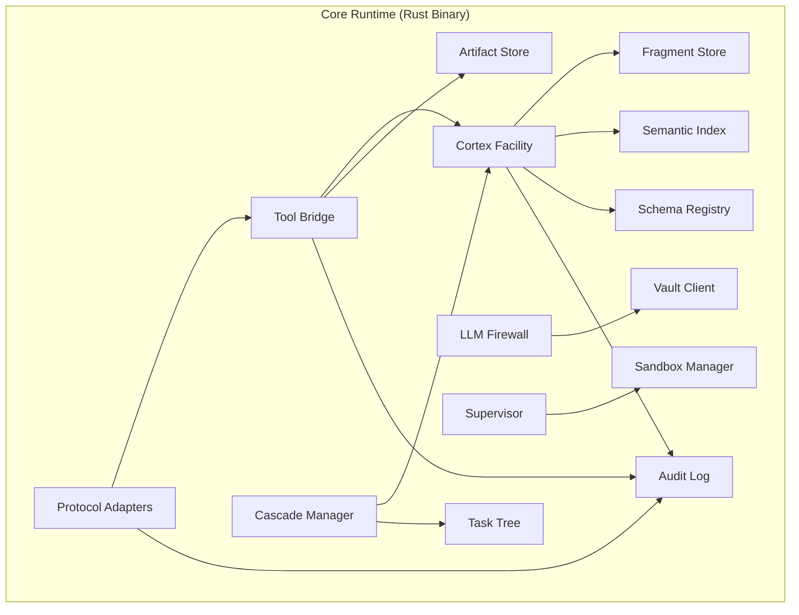

**Rust crate dependencies:**

| Crate | Purpose |
|---|---|
| `axum` | HTTP server for protocol adapters and platform API |
| `a2a-rs` | A2A protocol implementation (Agent Cards, JSON-RPC, task lifecycle) |
| `rmcp` | Official MCP Rust SDK for tool connectivity |
| `serde` | Serialization for Agent Cards, fragments, messages |
| `redb` | Embedded key-value store for Cortex fragment storage |
| `aho-corasick` | Multi-pattern matching for LLM Firewall secret scanning |
| `tokio` | Async runtime |
| `tonic` | gRPC for agent-to-core communication within sandboxes |
| `bollard` | Docker/OCI runtime API client for sandbox management |
| `virtualization-rs` | Apple Virtualization.framework bindings (macOS, compile-time feature) |

## Key Features and Design Ideas

### 1. Cortex — Typed Knowledge Facility

The Cortex is the unified knowledge layer. It replaces the need for separate "message bus" and "knowledge bus" abstractions — all inter-agent knowledge flows as typed, compressed fragments through a single facility.

The core enforces the **language** of fragments (their structure), not the **vocabulary** (what types exist). Agents declare their own fragment kinds and schemas at registration time. The core reserves the `finit.*` namespace for built-in kinds; everything else is agent-defined.

#### Fragment Structure

```rust
/// Atomic unit of typed compressed knowledge.
/// Core does not interpret content — it stores, indexes, and delivers.
struct CortexFragment {
    /// Namespaced type tag. Declared by producers, not by core.
    /// e.g., "finit.agent.manifest", "acme.security.vuln"
    kind: FragmentKind,

    /// Schema for content validation and storage optimization.
    schema_ref: SchemaRef,

    /// The knowledge itself. Opaque to core — conforms to schema.
    content: Bytes,

    /// Metadata the core reasons about.
    meta: FragmentMeta,
}

struct FragmentMeta {
    source: AgentId,
    version: u64,               // monotonic per (source, kind, key)
    key: String,                // dedup key within (source, kind)
    ttl: Option<Duration>,      // auto-expire; None = permanent
    supersedes: Option<FragmentId>,  // logical update chain
    compressed: Encoding,       // none | zstd — storage layer chooses
}

/// Kind is a namespaced string, not an enum.
struct FragmentKind(String);

/// Schema is referenced, not inlined. Registered once per kind.
struct SchemaRef(String);
```

#### Cortex API

```rust
trait Cortex {
    /// Publish a knowledge fragment. Validates against registered schema.
    fn publish(&self, fragment: CortexFragment) -> Result<FragmentId>;

    /// Point-in-time query by kind, key prefix, task scope.
    fn query(&self, filter: &CortexQuery) -> Result<Vec<CortexFragment>>;

    /// Semantic search over fragment content embeddings.
    fn semantic_search(&self, query: &str, max: usize) -> Result<Vec<FragmentMatch>>;

    /// Interest-based subscription. NOT broadcast — only matching fragments delivered.
    fn subscribe(&self, interests: &[FragmentInterest]) -> Result<CortexSubscription>;

    /// Register a new fragment kind + schema. Called by agents at registration.
    fn register_kind(&self, kind: FragmentKind, schema: JsonSchema) -> Result<()>;
}

struct FragmentInterest {
    kinds: Vec<FragmentKind>,
    key_prefix: Option<String>,
    references: Option<Vec<FragmentId>>,  // for tracking action resolutions
}
```

#### Storage Optimization via Types

Typing fragments enables the storage layer to optimize without understanding semantics:

| Optimization | Mechanism |
|---|---|
| Columnar compression | Same-kind fragments share schema; store fields as columns |
| Schema-aware indexing | Build inverted indexes on typed fields (e.g., domain → agents) |
| Dedup by (source, kind, key) | Latest version supersedes; audit trail via `supersedes` chain |
| TTL-based compaction | Health signals: TTL 30s. Manifests: permanent. Different compaction schedules |

#### Built-in Fragment Kinds

| Kind | Purpose | Published By |
|---|---|---|
| `finit.agent.manifest` | Agent capability declarations | Core (from A2A Agent Cards) |
| `finit.tool.definition` | Callable function definitions with embeddings | Core (from agent manifests) |
| `finit.agent.health` | Health status signals | Core (from Supervisor) |
| `finit.task.state` | Task tree state and provenance | Core (from Task Tree) |
| `action_needed.*` | Action resolution requests | Any agent |
| `action_response` | Resolution attempt results | Subscribed agents |
| `action_decision` | Escalation to user | Core (Cascade Manager) |
| `action_resolution` | User or agent resolution | User / resolving agent |

All other kinds are agent-defined via `register_kind()`.

### 2. Multi-Protocol Agent Communication

Agents are opaque HTTP services that communicate via one of three supported protocols. The core normalizes all protocols into a common internal representation — the coordinator and Cortex are protocol-agnostic.

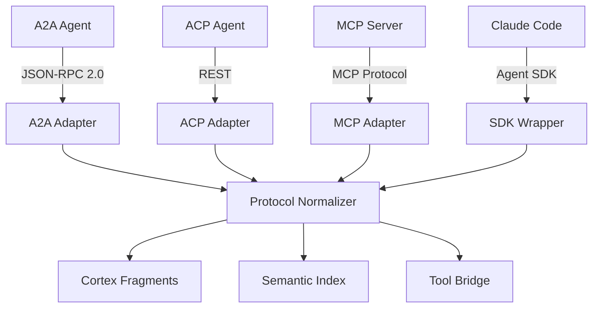

#### Supported Protocols

| Protocol | Wire Format | Discovery | Use Case |
|---|---|---|---|
| **A2A** (Google) | JSON-RPC 2.0 over HTTP | `/.well-known/agent.json` | Primary agent-to-agent protocol. Richest task lifecycle. |
| **ACP** (IBM) | Standard REST (HTTP verbs) | `GET /agents` | BeeAI agents, IBM ecosystem. Simpler than A2A. |
| **MCP** | MCP protocol (stdio/HTTP) | Server tool listing | Tool servers, Claude Code, resource providers. |

```rust
/// Protocol adapter trait — core is protocol-agnostic.
trait AgentProtocol {
    /// Fetch manifest and normalize into Cortex fragments.
    fn register(&self, endpoint: &str) -> Result<AgentManifest>;

    /// Invoke an agent function, return result.
    fn invoke(&self, agent: &AgentId, tool: &str,
              input: Bytes) -> Result<InvocationResult>;

    /// Stream results for long-running invocations.
    fn invoke_stream(&self, agent: &AgentId, tool: &str,
                     input: Bytes) -> Result<impl Stream<Item = Bytes>>;

    /// Health check.
    fn health(&self, agent: &AgentId) -> Result<HealthStatus>;
}
```

On registration, every protocol's manifest is normalized into the same Cortex fragments (`finit.agent.manifest`, `finit.tool.definition`). The coordinator discovers and invokes tools identically regardless of which protocol the underlying agent speaks.

#### Mountable Agent Ecosystems

Existing agent platforms can be mounted as Finit agents through protocol adapters:

| Platform | Mount Strategy | What You Get |
|---|---|---|
| **Claude Code** | Agent SDK wrapper → A2A adapter | Full Claude Code agent loop (Read, Edit, Bash, etc.) as callable Finit tools |
| **OpenHands** | A2A adapter around OpenHands SDK | CodeActAgent for coding tasks, existing MCP integrations |
| **BeeAI agents** | ACP adapter (native) | IBM's agent ecosystem, direct ACP protocol support |
| **Any MCP server** | MCP adapter (native via `rmcp`) | Tool servers become agent functions in the Semantic Index |

Claude Code mounting example (thin A2A wrapper around the Agent SDK):

```python
# Claude Code exposed as a Finit agent via A2A
class ClaudeCodeA2AAgent:
    agent_card = AgentCard(
        id="anthropic.claude-code",
        name="Claude Code",
        tools=[
            Tool(name="develop", description="Write code, fix bugs, implement features",
                 input_schema={"task": "string", "spec": {"$ref": "#/ArtifactRef"}}),
            Tool(name="review", description="Code review with evidence",
                 input_schema={"code": {"$ref": "#/ArtifactRef"}, "spec": {"$ref": "#/ArtifactRef"}}),
        ],
    )

    async def handle_develop(self, task, spec=None):
        async for msg in claude_agent_sdk.query(
            prompt=f"Task: {task}",
            options=ClaudeAgentOptions(allowed_tools=["Read", "Edit", "Bash", "Glob"]),
        ):
            ...
        return {"artifacts": artifact_ref}
```

#### A2A Protocol Details

A2A is the primary and most feature-rich protocol. Agents implementing A2A are opaque HTTP services using JSON-RPC 2.0. They can be written in any language with an A2A SDK: Python, Go, Rust, JavaScript, Java, .NET.

#### Agent Card

Every agent publishes an Agent Card at registration — a JSON document describing identity, capabilities, callable functions, and secret requirements:

```json
{
  "id": "acme.security-scanner",
  "name": "OWASP Security Scanner",
  "version": "1.2.0",
  "description": "Scans code artifacts for OWASP Top 10 vulnerabilities",
  "url": "http://security-scanner:9000",
  "provider": { "organization": "Acme Corp" },
  "skills": [
    { "id": "scan_code", "name": "Full Security Scan" },
    { "id": "check_dependency", "name": "CVE Dependency Check" },
    { "id": "explain_finding", "name": "Finding Explanation" }
  ],
  "tools": [
    {
      "name": "scan_code",
      "description": "Full OWASP security scan on code artifacts",
      "input_schema": {
        "code": { "$ref": "#/ArtifactRef" },
        "profile": { "enum": ["quick", "thorough", "auth-focused"] }
      },
      "output_schema": {
        "report": { "$ref": "#/ArtifactRef" },
        "critical_count": "int",
        "pass": "bool"
      }
    },
    {
      "name": "check_dependency",
      "description": "Check a single dependency for known CVEs",
      "input_schema": {
        "name": "string",
        "version": "string"
      },
      "output_schema": {
        "safe": "bool",
        "cves": [{ "id": "string", "severity": "string" }]
      }
    },
    {
      "name": "explain_finding",
      "description": "Detailed explanation of a specific security finding",
      "input_schema": {
        "report": { "$ref": "#/ArtifactRef" },
        "finding_id": "string"
      },
      "output_schema": {
        "explanation": "string",
        "remediation": "string"
      }
    }
  ],
  "cortex": {
    "publishes": [
      { "kind": "acme.security.capability", "schema": { "..." : "..." } }
    ],
    "consumes": [
      { "kind": "finit.agent.manifest" },
      { "kind": "action_needed.secret_required" }
    ]
  },
  "secrets": [
    { "key": "SONAR_KEY", "description": "SonarQube API key", "required": false }
  ],
  "resources": {
    "cpu_millicores": 2000,
    "memory_mb": 4096,
    "max_pids": 256,
    "disk_mb": 2048
  }
}
```

Each agent defines **multiple callable functions** — not one generic invoke endpoint. Functions are registered individually in the Semantic Index, each with its own embedding.

#### Agent Registration Flow

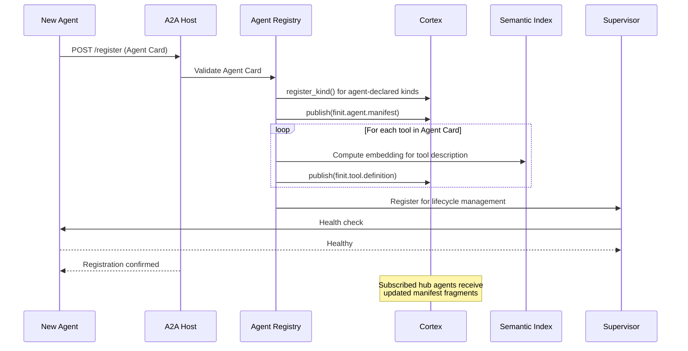

### 3. Semantic Tool Registry

All agent-defined tool definitions are stored in the Cortex with embeddings, forming the Semantic Tool Registry. Hub agents discover relevant tools via semantic search instead of receiving a broadcast of all definitions.

The coordinator has exactly **5 stable tools** regardless of how many agents are registered:

| Tool | Purpose |
|---|---|
| `search_tools` | Semantic search over all agent functions in the registry |
| `invoke_tool` | Call a discovered agent function by tool ID |
| `mount_artifact` | Mount an S3 artifact for content inspection |
| `query_cortex` | Query shared knowledge fragments |
| `request_human_input` | Pause task, request user decision (last resort) |

**Prompt size is O(1)** — 5 tool definitions (~250 tokens) regardless of whether there are 5 or 500 agents. Discovery happens at runtime through `search_tools`, not through prompt stuffing.

Embedding is computed locally using lightweight models (`all-MiniLM-L6-v2` or `bge-small-en-v1.5`, 384 dimensions, CPU-only).

#### Search and Invocation Flow

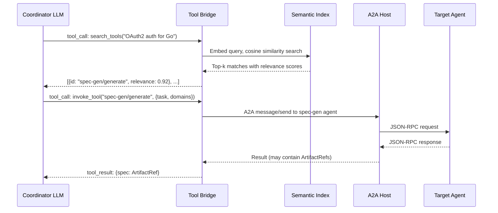

### 4. Supervisor Pattern — Agents as Tools

The coordinator is an LLM-powered agent that invokes other agents via native tool calling. The LLM dynamically reasons about which agents to call, in what order, and with what inputs. This follows the supervisor pattern where tool calls are the communication boundary.

#### Nested Supervisors

Any agent can be a supervisor of sub-agents, forming a hierarchy. Each level uses the same mechanism: LLM tool calling → Tool Bridge → A2A transport.

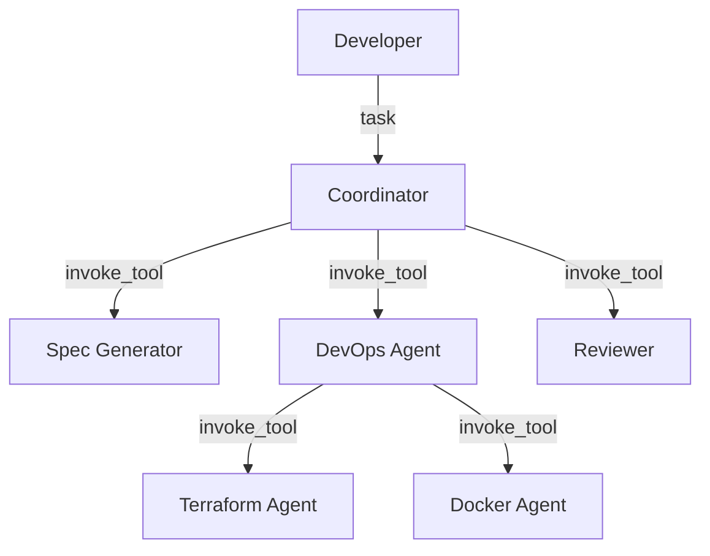

#### Task Execution Flow

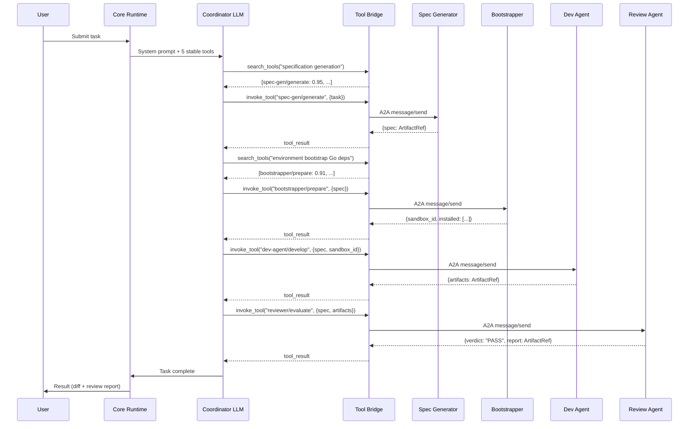

### 5. Artifact Store

Large outputs (review reports, security analyses, code bundles) are stored in S3-compatible object storage. Only `ArtifactRef` references are passed in function call results — never inline data. This keeps LLM context clean and prevents token burn on large payloads.

#### ArtifactRef Type

`ArtifactRef` is a first-class type in the schema language. Any agent that encounters it knows the value is stored, not inline, and must be mounted for inspection.

```rust
struct ArtifactRef {
    /// S3-compatible URI. e.g., "s3://finit-artifacts/tasks/t-123/review.json"
    uri: String,

    /// Fragment kind — same namespace as Cortex.
    kind: FragmentKind,

    /// Size, type, and integrity.
    size_bytes: u64,
    content_type: String,
    checksum: String,         // SHA-256

    /// Provenance.
    created_by: AgentId,
    task_id: TaskId,
    created_at: DateTime,
}
```

**Rule**: any output over 1KB MUST be stored as an artifact. Function call results contain `ArtifactRef`, not the data itself.

#### Artifact Store API

```rust
trait ArtifactStore {
    /// Store artifact, return reference.
    fn put(&self, task_id: &TaskId, kind: &FragmentKind,
           data: Bytes, content_type: &str) -> Result<ArtifactRef>;

    /// Mount artifact into agent sandbox filesystem.
    fn mount(&self, artifact: &ArtifactRef, target: &Path) -> Result<MountedArtifact>;

    /// Stream artifact content for hub agents without a sandbox.
    fn stream(&self, artifact: &ArtifactRef) -> Result<ByteStream>;

    /// List artifacts for a task.
    fn list(&self, task_id: &TaskId) -> Result<Vec<ArtifactRef>>;
}
```

The coordinator accesses artifacts via the `mount_artifact` tool:

```
mount_artifact
  input:  { ref: ArtifactRef, mode: "full" | "summary" | "head" }
  output: { content: string }
```

### 6. action_needed Cascade — Generalized HITL

Human-in-the-loop is not a special protocol. It is a generalized fragment cascade within the Cortex. When an agent needs something it cannot resolve, it publishes an `action_needed` fragment. Subscribed agents attempt resolution. If all fail, the platform escalates to the user.

#### Fragment Lifecycle

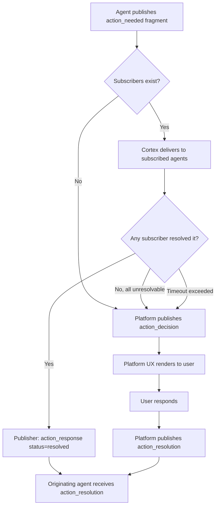

#### Cascade Sequence

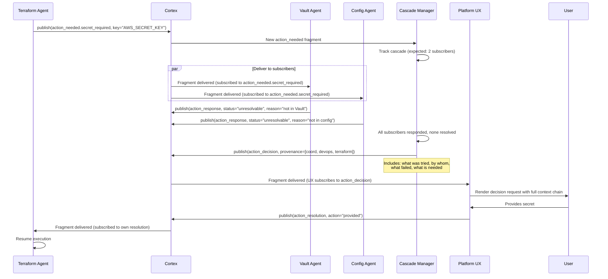

#### action_needed Subtypes

Agents subscribe only to the subtypes they can handle:

| Subtype | Example Subscriber | Resolution |
|---|---|---|
| `action_needed.secret_required` | Vault Agent, Config Agent | Look up in Vault/config, inject if found |
| `action_needed.dependency_missing` | Bootstrapper Agent | Install in sandbox |
| `action_needed.approval_required` | Policy Agent | Auto-approve if within policy bounds |
| `action_needed.clarification_needed` | (none — goes straight to user) | User provides clarification |
| `action_needed.resource_exhausted` | Supervisor | Allocate more resources or deny |
| `action_needed.permission_denied` | Policy Agent | Check policy, grant or escalate |

If no agent subscribes to a given subtype, the Cascade Manager escalates directly to the user.

#### What the User Sees

The platform UX subscribes to `action_decision` fragments and renders them with the full provenance chain from the Task Tree:

```
Task: "Set up CI/CD pipeline for the Go service"
  → DevOps Agent: configuring infrastructure
    → Terraform Agent: provisioning state backend
      → needs AWS_SECRET_KEY

Already tried:
  ✗ Vault Agent: not found in Vault
  ✗ Config Agent: not found in environment

[ Provide Secret ]  [ Skip ]  [ Abort Task ]
```

The user sees exactly what is needed, from whom, and why — even when the requesting agent is multiple layers deep. The platform assembles this context from the Task Tree, not from LLM interpretations.

#### Agent Code for Raising Actions

From the agent's perspective, there is no special HITL API. It uses the standard Cortex publish/subscribe:

```python
# Inside Terraform Agent — does not know its depth in the hierarchy
# Does not address the user. Does not know about the UI.

secret = runtime.vault.get("AWS_SECRET_KEY")
if secret is None:
    needed = runtime.cortex.publish(Fragment(
        kind="action_needed.secret_required",
        key="AWS_SECRET_KEY",
        content={
            "description": "AWS secret access key",
            "instructions": "Generate at AWS Console > IAM > Security Credentials",
            "scope": "project",
            "response_schema": {"type": "string", "format": "secret"},
        },
    ))

    # Block until resolved — platform + agents handle the cascade
    resolution = runtime.cortex.subscribe(
        FragmentInterest(kinds=["action_resolution"], references=[needed.id])
    )
    res = resolution.recv()

    if res.content["action"] == "provided":
        secret = runtime.vault.get("AWS_SECRET_KEY")  # now populated
    elif res.content["action"] == "aborted":
        raise TaskAborted()
```

### 7. Secrets Management

Three layers protect secrets throughout the platform:

#### Layer 1 — Declaration and Provisioning

Agents declare required secrets in their Agent Card. The core checks Vault on agent invocation and injects found secrets as environment variables into the Firecracker VM — never into LLM prompts.

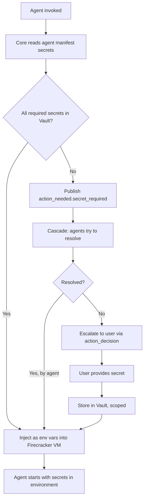

#### Layer 2 — Vault Scoping

```
secret/finit/
├── global/                     # Shared across all projects
│   └── LLM_API_KEY
├── projects/
│   └── {project-id}/
│       ├── GITHUB_TOKEN        # Scoped to this project
│       └── GITVERSE_TOKEN
└── tasks/
    └── {task-id}/
        └── ONE_TIME_TOKEN      # Scoped to a single task, auto-expires
```

Agents see only secrets at their authorized scope level.

#### Layer 3 — LLM Firewall

All outbound LLM calls pass through a firewall that scans for known secret values:

```rust
struct LlmFirewall {
    vault: VaultClient,
    /// Multi-pattern matcher built from all known secret values.
    /// Aho-Corasick: single-pass O(n) scan regardless of secret count.
    secret_patterns: AhoCorasick,
}

impl LlmFirewall {
    fn inspect(&self, request: &CompletionRequest) -> Result<(), FirewallBlock> {
        let text = request.full_text();
        if let Some(match_) = self.secret_patterns.find(&text) {
            return Err(FirewallBlock {
                // Log the KEY, never the VALUE
                secret_key: self.resolve_match(match_),
                agent_id: request.source_agent.clone(),
            });
        }
        Ok(())
    }

    /// Rebuild patterns when Vault contents change.
    fn refresh_patterns(&mut self) {
        let secrets = self.vault.list_values("secret/finit/");
        self.secret_patterns = AhoCorasick::new(
            secrets.iter().map(|s| s.value.as_bytes())
        );
    }
}
```

If a secret is detected in a prompt: request is **blocked**, the event is logged (without the secret value), and the user is alerted.

### 8. Agent Isolation — Platform-Adaptive OCI Sandboxing

Each agent runs inside an OCI-compatible sandbox with configurable isolation level. The Sandbox Manager abstracts the isolation backend — same OCI container images run on all platforms.

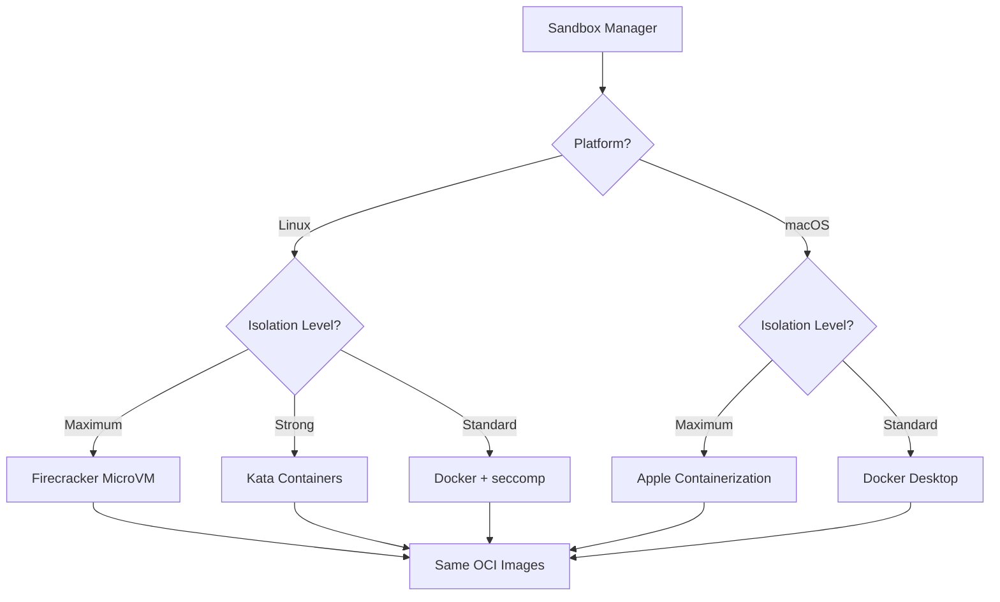

#### Platform Isolation Backends

| Platform | Backend | Isolation | Boot Time | Mechanism |
|---|---|---|---|---|
| **Linux** | Firecracker | Per-agent kernel via KVM | < 150ms | Rust-native microVM, virtio devices |
| **Linux** | Kata Containers | Per-agent kernel via KVM | < 1s | OCI runtime, drop-in Docker replacement |
| **Linux** | Docker + seccomp | Shared kernel, namespace isolation | Instant | Default for development |
| **macOS (Apple Silicon)** | Apple Containerization | Per-agent kernel via Virtualization.framework | < 1s | Native macOS framework, Kata kernel, OCI-compatible |
| **macOS** | Docker Desktop | Shared Linux VM | Instant | Default for development |

The Sandbox Manager selects the backend based on platform detection and configured isolation level. Agents do not know or care which backend runs them — they see a standard Linux environment with their OCI image.

```rust
/// Platform-adaptive sandbox management.
/// Agents are OCI containers — same image runs everywhere.
trait SandboxBackend {
    /// Create and start a sandbox from an OCI image.
    fn create(&self, config: SandboxConfig) -> Result<SandboxId>;

    /// Stop and destroy a sandbox.
    fn destroy(&self, id: &SandboxId) -> Result<()>;

    /// Health check.
    fn health(&self, id: &SandboxId) -> Result<HealthStatus>;

    /// Get network endpoint for agent communication.
    fn endpoint(&self, id: &SandboxId) -> Result<Endpoint>;
}

/// Implementations selected at runtime, not compile time.
/// FirecrackerBackend — Linux only, KVM required
/// KataBackend — Linux only, OCI runtime
/// AppleVirtualizationBackend — macOS only (behind feature flag)
/// DockerBackend — Universal fallback
```

#### Isolation Guarantees (VM-level backends)

| Boundary | Mechanism | Prevents |
|---|---|---|
| Kernel | Dedicated Linux kernel per sandbox (KVM / Virtualization.framework) | Kernel exploits crossing agents |
| Memory | Hardware-enforced via hypervisor memory mapping | Memory corruption, side-channel attacks |
| Filesystem | Sandbox-private rootfs; project dir mounted R/O | Agent A modifying Agent B's state |
| Network | Sandbox-private network; deny-by-default | Unauthorized egress; inter-agent bypass |
| Resources | cgroups / hypervisor limits; CPU, memory, PID | Resource starvation; fork bombs; OOM cascading |
| Communication | Agent protocol over virtual network; Core-mediated only | Direct agent-to-agent coupling |

#### Recommended Deployment Progression

| Phase | Backend | When |
|---|---|---|
| **Development** | Docker (any platform) | Building and testing agents locally |
| **Staging** | Kata Containers (Linux) / Apple Containerization (macOS) | Validating isolation, same OCI images |
| **Production** | Firecracker (Linux) | Maximum isolation, minimum overhead |

### 9. Agent Lifecycle

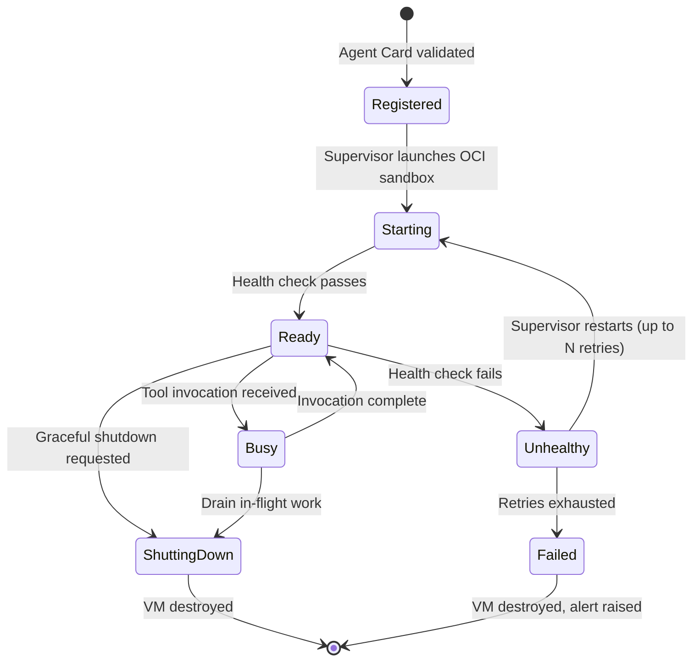

**Lifecycle management by Supervisor:**

- **Lazy start**: Sandbox launched on first matching tool invocation, not at registration
- **Health checks**: Periodic health check calls via agent protocol; configurable interval per agent
- **Restart policy**: Configurable max retries with exponential backoff
- **Graceful shutdown**: In-flight work drained; timeout before forced sandbox destruction
- **Hot reload**: Agent container updated → new sandbox launched → traffic shifted → old sandbox destroyed

### 10. Cortex Compiler — Dynamic Prompt Knowledge

Hub agents (coordinator, router) need compressed knowledge about the agent ecosystem in their system prompts. The Cortex Compiler produces per-consumer views from Cortex fragments, but these views are **not hardcoded Rust types**. Core delivers filtered fragments; each hub agent's own prompt compilation logic decides how to render them.

#### Compilation Flow

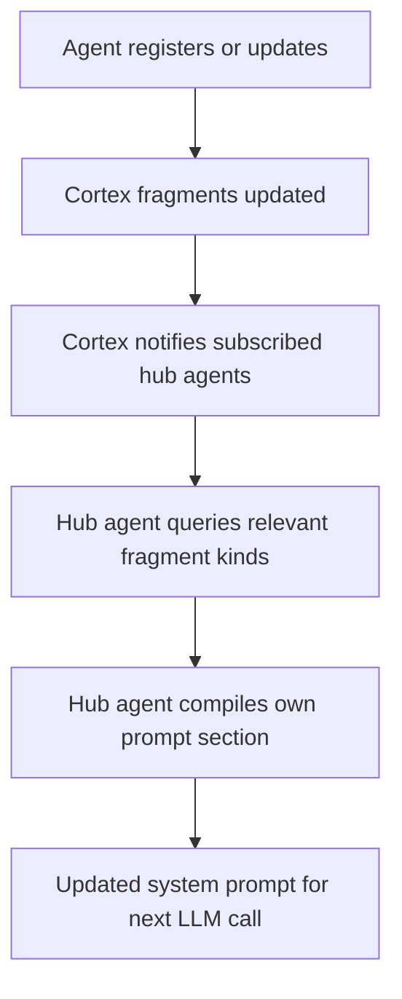

**Recompilation triggers:** agent registered/deregistered, agent card updated, health state changed, performance profile shifted.

**Per-consumer projections** — each hub agent subscribes to different fragment kinds and renders its own view:

| Hub Agent | Subscribes To | Renders |
|---|---|---|
| Coordinator | `finit.agent.manifest`, `finit.agent.health` | Agent summaries, health status, pipeline patterns |
| Router | `finit.agent.manifest` | Domain → agent mapping for classification |
| Dev Agent | `finit.agent.manifest` (reviewer only) | What the reviewer expects, output format requirements |

The core provides the fragment delivery. How agents compress this into their prompts is their own responsibility — the core has no opinion on prompt formatting.

### 11. MCP Integration

Agents can declare MCP server requirements in their Agent Card. The core launches MCP servers within the agent's Firecracker VM and provides pre-connected clients.

```json
{
  "mcp_servers": [
    {
      "name": "gitverse-ci",
      "transport": "stdio",
      "command": "gitverse-mcp",
      "args": ["--project", "{{project_id}}"]
    }
  ]
}
```

The Env-Aware Agent can dynamically discover and deploy MCP servers into sandboxes during environment preparation. MCP server lifecycle (start, health check, restart) is managed by the core within the agent's VM boundary.

### 12. LLM Integration

All LLM access goes through the core's LLM Client, which enforces structured output and passes through the LLM Firewall.

```rust
trait LlmClient {
    /// Send prompt, return schema-validated response.
    /// Firewall scans prompt before sending. Schema validation on response.
    /// Retries up to 3 times on invalid output.
    fn complete(&self, req: CompletionRequest) -> Result<Bytes>;
}

struct CompletionRequest {
    system_prompt: String,
    messages: Vec<ChatMessage>,
    schema: Option<JsonSchema>,   // structured output enforcement
    tools: Option<Vec<ToolDef>>,  // function calling definitions
    temperature: f64,
    max_tokens: usize,
    source_agent: AgentId,        // for firewall and audit
}
```

The LLM Client is injected into agents as part of the agent runtime. Agents do not manage LLM connections directly.

### 13. Agent Runtime API

Every agent receives a runtime handle providing access to all platform facilities:

```python
# Agent runtime API — same interface regardless of language

class AgentRuntime:
    cortex: CortexClient       # publish, query, subscribe, semantic_search
    artifacts: ArtifactClient  # put, mount, stream, list
    vault: VaultClient         # get (scoped to agent's authorization)
    llm: LlmClient            # complete (behind firewall)
    mcp: dict[str, McpClient]  # pre-connected MCP clients by name
```

Agents interact with the platform exclusively through this API. They do not manage connections, discover other agents directly, or handle lifecycle concerns.

## Cost Estimation

### Development Effort

| Component | Effort | Notes |
|---|---|---|
| Core skeleton (Rust) | 3 person-weeks | axum server, config, logging, graceful shutdown |
| Cortex facility | 3 person-weeks | Fragment store (redb), schema registry, pub/sub, query engine |
| Semantic Index | 1.5 person-weeks | Embedding computation, cosine similarity, index management |
| Protocol Adapters (A2A + ACP) | 3 person-weeks | A2A (JSON-RPC, Agent Cards), ACP (REST), protocol normalizer |
| MCP Adapter | 1 person-week | rmcp client, tool listing → Cortex fragment normalization |
| Tool Bridge | 1.5 person-weeks | LLM tool call interception, protocol dispatch, response mapping |
| Artifact Store | 1 person-week | S3 client, ArtifactRef type, mount/stream API |
| Cascade Manager | 1.5 person-weeks | action_needed tracking, timeout, escalation logic |
| Vault integration | 1 person-week | Vault client, secret injection, scope enforcement |
| LLM Firewall | 1 person-week | Aho-Corasick scanner, pattern refresh, block/alert |
| Sandbox Manager | 2 person-weeks | OCI abstraction, Docker backend, Kata/Firecracker backend |
| Apple Virtualization backend | 1 person-week | macOS-specific, behind feature flag, via virtualization-rs |
| LLM Client | 1 person-week | OpenAI-compat client, schema validation, retry logic |
| Audit Log | 0.5 person-weeks | Append-only structured log for all events |
| Platform API + WebUI | 2 person-weeks | HTTP API for task submission, WebSocket for live updates |
| Claude Code SDK wrapper | 1 person-week | A2A adapter around claude-agent-sdk |
| First agent (Spec Generator) | 1 person-week | Validates full framework end-to-end |
| Remaining built-in agents | 4 person-weeks | Router, Env-Aware, Dev, Review — 1 week each |
| CLI | 1 person-week | Task submission, decision responses, result display |
| **Total** | **~31 person-weeks** | ~8 months for one developer |

### Infrastructure Costs

- **No cloud costs for PoC** — single on-prem machine
- **Hardware**: 32GB+ RAM, GPU for local LLM inference (vLLM/Ollama), 256GB+ SSD
- **Software**: All open-source (Rust, redb, Vault, MinIO for S3, Docker, vLLM/Ollama)

### Risks and Contingency

| Risk | Mitigation |
|---|---|
| Sandbox startup latency too high | Docker for dev (instant), Kata/Firecracker for production (< 1s). Pre-warm sandbox pool for hot path. |
| macOS isolation differs from Linux | OCI images are identical; only the hypervisor changes. Test matrix covers both platforms. |
| Semantic search quality insufficient for tool discovery | Fallback to keyword + domain matching; use better embedding model; allow agents to tag tools explicitly |
| Aho-Corasick pattern set too large for memory | Secrets are typically < 1000 values; pattern set fits in < 1MB. If needed, use Bloom filter pre-check |
| Protocol adapter overhead for local communication | All protocols are HTTP-based on localhost; if insufficient, add UDS transport as optimization |
| Embedded KV store insufficient for Cortex query patterns | redb supports prefix scans; if complex queries needed, upgrade to SQLite via rusqlite |
| Cascade Manager deadlock (circular action_needed) | Timeout per cascade (30s default); cycle detection on fragment references |
| LLM Firewall false positives (short secrets match normal text) | Minimum secret length threshold (8 chars); allowlist for common substrings |
| Claude Code SDK API changes | Thin wrapper layer absorbs SDK changes; SDK is versioned and stable |

## Future Goals

### Short-term (PoC complete → v0.2)

- Pipeline DAG defined in YAML configuration instead of LLM-determined
- Agent hot-reload: update agent container without restarting core
- Cortex fragment-level ACLs for stricter inter-agent isolation
- Metrics export (Prometheus) from core and per-agent resource usage
- `action_needed` cascade analytics — track resolution rates, time-to-resolve, escalation frequency

### Long-term (v0.3+)

- **Distributed mode**: Cortex backed by NATS JetStream or etcd; agents across machines
- **Agent marketplace**: community-contributed agents with signed Agent Cards and trust scores
- **Learning loop**: Cortex fragments from past tasks inform future routing and spec generation — agents improve with use
- **A2A federation**: expose Finit agents as A2A services for interop with external agent systems
- **Advanced cascade routing**: ML-based prediction of which agent can resolve an `action_needed` fastest
- **Cost tracking**: per-task token usage, compute time, and artifact storage accounting

### Known Limitations

- **Single machine only**: No distributed deployment in PoC. Cortex and all sandboxes on one host.
- **No persistence across core restarts**: Cortex fragments survive (disk-backed), but in-flight tasks and cascade state are lost. WAL-based recovery deferred.
- **Fixed coordinator prompt**: Coordinator system prompt is static per deployment. Dynamic prompt assembly from Cortex fragments is an optimization for v0.2.
- **No agent-to-agent trust model**: All registered agents are equally trusted. Signed manifests and capability-based trust deferred.
- **Firecracker requires Linux + KVM**: Production-grade isolation on macOS depends on Apple Containerization framework (macOS Tahoe+). Docker fallback available on all platforms.
