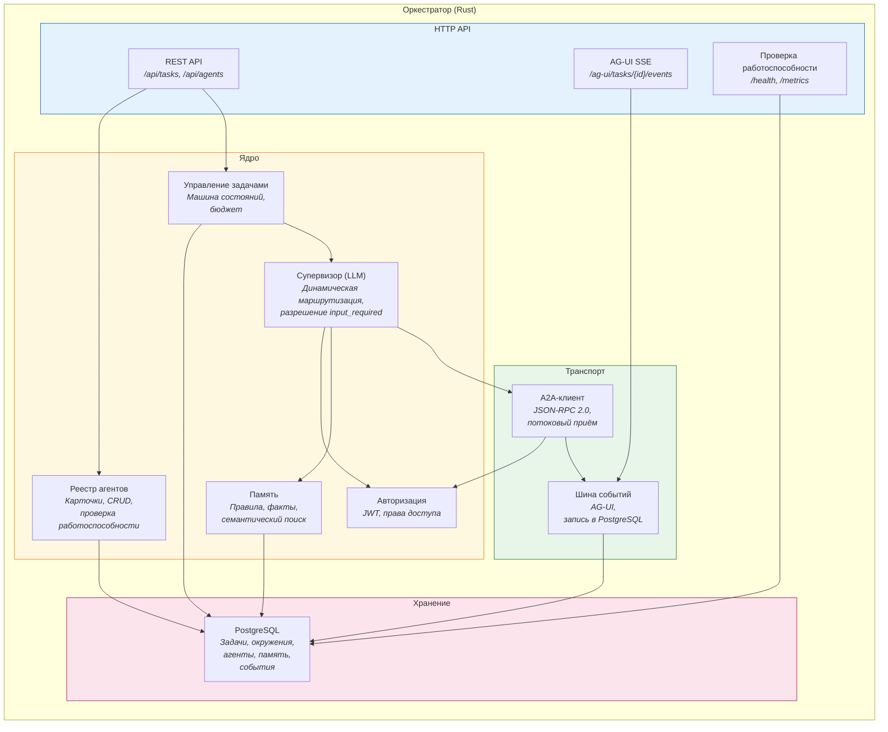
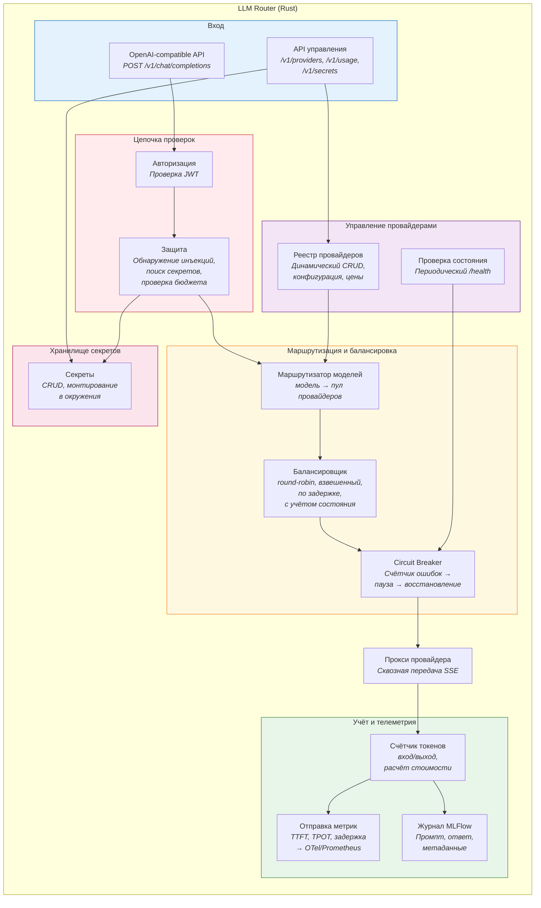
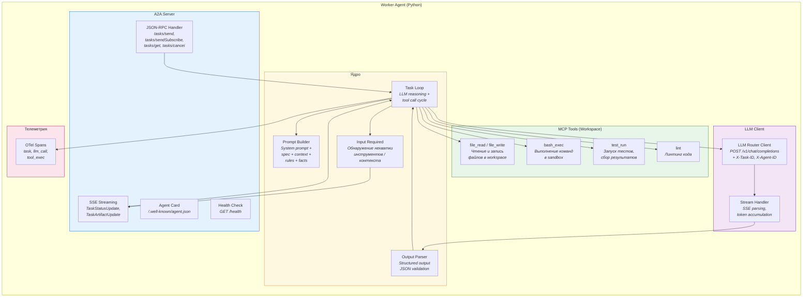
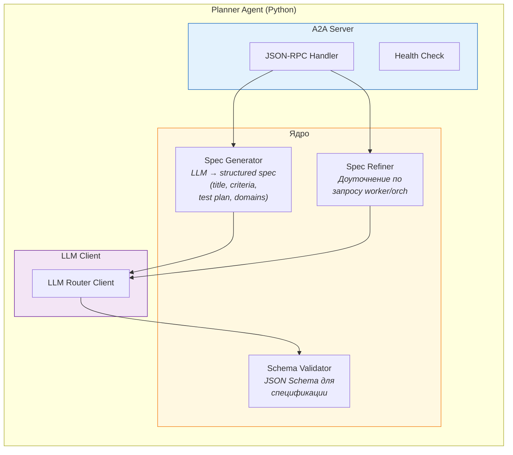
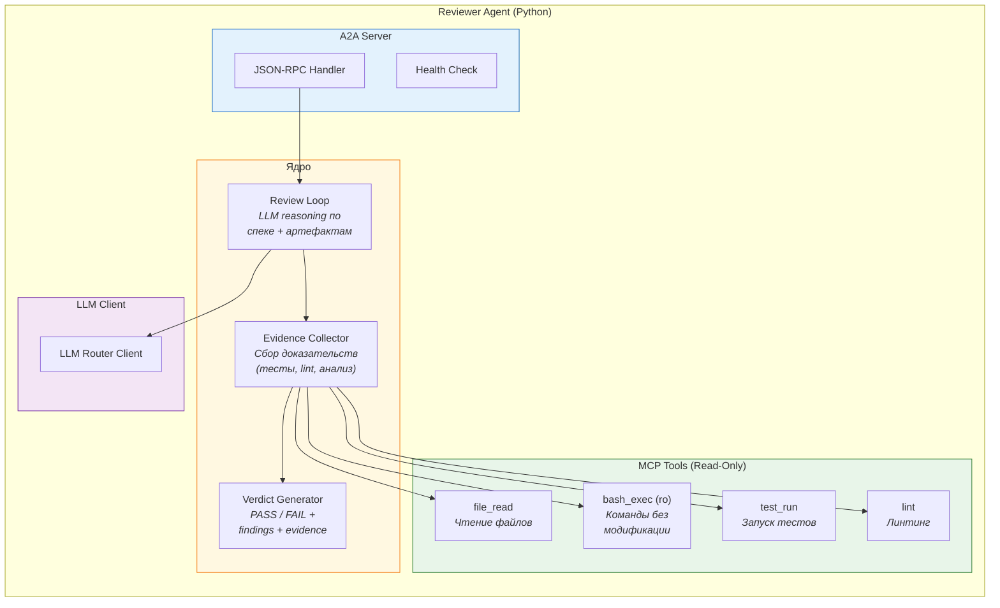

# C4 Component -- Оркестратор и LLM Router

Внутреннее устройство двух ключевых сервисов.

## Оркестратор



### Компоненты оркестратора

| Компонент | Ответственность |
|---|---|
| **REST API** | CRUD задач, управление агентами |
| **AG-UI SSE** | Потоковая доставка событий в WebUI |
| **Управление задачами** | Машина состояний задачи, бюджет, переходы |
| **Супервизор (LLM)** | Динамический выбор следующего агента, разрешение `input_required`, эскалация |
| **Реестр агентов** | Хранение карточек агентов, периодическая проверка работоспособности |
| **Память** | Правила (принудительные) и факты (индексируемые) по задачам и окружениям |
| **Авторизация** | Генерация JWT, проверка прав доступа |
| **A2A-клиент** | Вызов агентов по JSON-RPC 2.0, приём потоковых ответов |
| **Шина событий** | Трансляция A2A-событий в формат AG-UI, запись в PostgreSQL |
| **PostgreSQL** | Единственное хранилище: задачи, окружения, реестр, память, события |

---

## LLM Router



### Компоненты LLM Router

| Компонент | Ответственность |
|---|---|
| **OpenAI API** | Приём запросов в OpenAI-compatible формате, потоковая передача SSE |
| **API управления** | CRUD провайдеров, статистика, управление секретами |
| **Авторизация** | Проверка JWT, извлечение идентификатора и прав агента |
| **Защита** | Обнаружение инъекций в промпты, поиск утечек секретов (Aho-Corasick), проверка бюджета |
| **Маршрутизатор моделей** | Соответствие имени модели → пул провайдеров |
| **Балансировщик** | Выбор конкретного провайдера из пула по стратегии |
| **Circuit Breaker** | Счётчик ошибок → пауза → пробный запрос → восстановление |
| **Прокси провайдера** | Проксирование HTTP с передачей SSE без буферизации |
| **Счётчик токенов** | Подсчёт входных/выходных токенов, расчёт стоимости по модели |
| **Отправка метрик** | TTFT, TPOT, общая задержка → OTel → Prometheus |
| **Журнал MLFlow** | Запись промпта/ответа/метаданных в MLFlow |
| **Реестр провайдеров** | Хранение конфигурации провайдеров, динамическое обновление |
| **Проверка состояния** | Периодическая проверка провайдеров, обновление статуса |
| **Хранилище секретов** | CRUD секретов, монтирование в окружения (env/file), паттерны для LLM Firewall |

---

## Worker Agent

Внутреннее устройство Worker — наиболее сложного агента, выполняющего генерацию кода и тестов.



### Компоненты Worker Agent

| Компонент | Ответственность |
|---|---|
| **JSON-RPC Handler** | Приём задач от оркестратора по A2A, управление жизненным циклом |
| **SSE Streaming** | Потоковая отправка промежуточных результатов (статус, артефакты) оркестратору |
| **Agent Card** | Описание возможностей агента для автоматической регистрации |
| **Task Loop** | Цикл reasoning: LLM решает → вызов инструмента → анализ результата → следующий шаг |
| **Prompt Builder** | Сборка промпта: системный промпт + спека + возможности workspace + правила + факты |
| **Output Parser** | Валидация JSON structured output от LLM, retry при ошибке парсинга |
| **Input Required** | Обнаружение ситуаций, когда агент не может продолжить (нет инструмента, неясные требования) |
| **MCP Tools** | Взаимодействие с sandbox через MCP-серверы: файлы, команды, тесты, линтинг |
| **LLM Router Client** | HTTP-клиент к LLM Router с заголовками X-Task-ID, X-Agent-ID для трекинга |
| **Stream Handler** | Парсинг SSE-потока от Router, аккумуляция токенов, извлечение structured output |
| **OTel Spans** | Создание span-ов для трассировки: task, llm_call, tool_exec |

### Task Loop (подробно)

```
1. Получить TaskContext от оркестратора (spec, workspace, feedback)
2. Собрать промпт (PromptBuilder)
3. loop:
   a. Вызов LLM через Router → structured output
   b. Парсинг действия: "write_file" | "run_command" | "run_tests" | "request_input" | "submit_result"
   c. Выполнение через MCP tool
   d. Добавить результат в контекст
   e. Если submit_result → собрать артефакты (diff, test results), вернуть оркестратору
   f. Если request_input → вернуть input_required с описанием проблемы
   g. Если budget close → завершить с partial result
4. Стриминг: каждое действие → TaskStatusUpdateEvent через SSE
```

---

## Planner Agent



| Компонент | Ответственность |
|---|---|
| **Spec Generator** | Генерация structured spec по описанию задачи: acceptance criteria, test plan, affected files, domains |
| **Spec Refiner** | Доуточнение спеки по запросу от worker (через оркестратор), сохранение версионности |
| **Schema Validator** | Валидация JSON-структуры спеки против JSON Schema |

---

## Reviewer Agent



| Компонент | Ответственность |
|---|---|
| **Review Loop** | Цикл ревью: LLM анализирует спеку + артефакты, решает какие проверки запустить |
| **Evidence Collector** | Сбор доказательств: запуск тестов, lint, чтение файлов, анализ diff |
| **Verdict Generator** | Формирование вердикта (PASS/FAIL) с findings и evidence на основе acceptance criteria из спеки |
