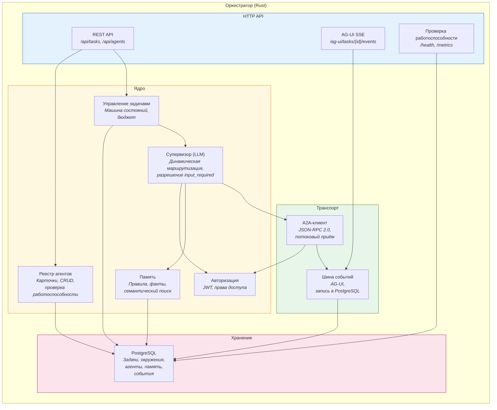
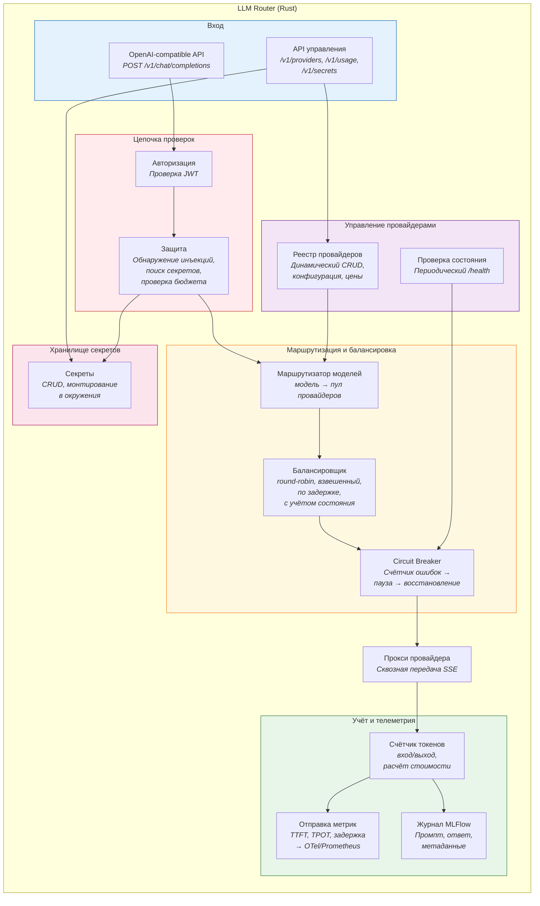

# C4 Component -- Оркестратор и LLM Router

Внутреннее устройство двух ключевых сервисов.

## Оркестратор

### Компоненты оркестратора

| Компонент | Ответственность |
|---|---|
| **REST API** | CRUD задач, управление агентами |
| **AG-UI SSE** | Потоковая доставка событий в WebUI |
| **Управление задачами** | Машина состояний задачи, бюджет, переходы |
| **Супервизор (LLM)** | Динамический выбор следующего агента, разрешение `input_required`, эскалация |
| **Реестр агентов** | Хранение карточек агентов, периодическая проверка работоспособности |
| **Память** | Правила (принудительные) и факты (индексируемые) по задачам и окружениям |
| **Авторизация** | Генерация JWT, проверка прав доступа |
| **A2A-клиент** | Вызов агентов по JSON-RPC 2.0, приём потоковых ответов |
| **Шина событий** | Трансляция A2A-событий в формат AG-UI, запись в PostgreSQL |
| **PostgreSQL** | Единственное хранилище: задачи, окружения, реестр, память, события |

---

## LLM Router

### Компоненты LLM Router

| Компонент | Ответственность |
|---|---|
| **OpenAI API** | Приём запросов в OpenAI-compatible формате, потоковая передача SSE |
| **API управления** | CRUD провайдеров, статистика, управление секретами |
| **Авторизация** | Проверка JWT, извлечение идентификатора и прав агента |
| **Защита** | Обнаружение инъекций в промпты, поиск утечек секретов (Aho-Corasick), проверка бюджета |
| **Маршрутизатор моделей** | Соответствие имени модели → пул провайдеров |
| **Балансировщик** | Выбор конкретного провайдера из пула по стратегии |
| **Circuit Breaker** | Счётчик ошибок → пауза → пробный запрос → восстановление |
| **Прокси провайдера** | Проксирование HTTP с передачей SSE без буферизации |
| **Счётчик токенов** | Подсчёт входных/выходных токенов, расчёт стоимости по модели |
| **Отправка метрик** | TTFT, TPOT, общая задержка → OTel → Prometheus |
| **Журнал MLFlow** | Запись промпта/ответа/метаданных в MLFlow |
| **Реестр провайдеров** | Хранение конфигурации провайдеров, динамическое обновление |
| **Проверка состояния** | Периодическая проверка провайдеров, обновление статуса |
| **Хранилище секретов** | CRUD секретов, монтирование в окружения (env/file), паттерны для LLM Firewall |
