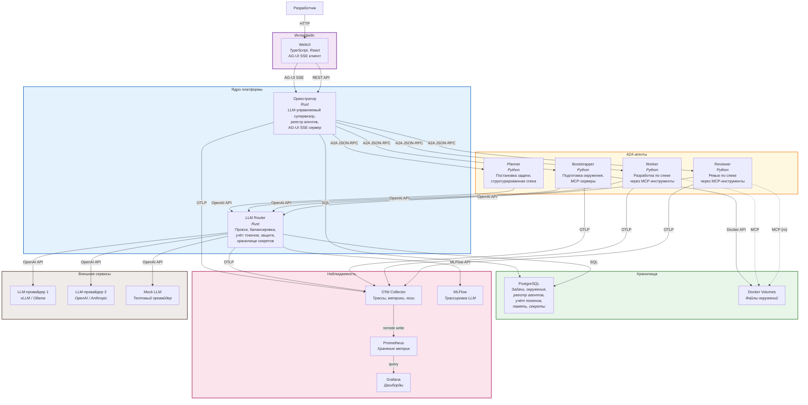

# C4 Container -- Finit Platform

Внутренняя структура платформы: сервисы, хранилища, протоколы связи.

## Протоколы связи

| Связь | Протокол | Формат | Потоковая передача |
|---|---|---|---|
| WebUI → Оркестратор | HTTP REST + AG-UI SSE | JSON | Да (SSE) |
| Оркестратор → Агенты | A2A (JSON-RPC 2.0) | JSON | Да (SSE) |
| Агенты → LLM Router | OpenAI-compatible API | JSON | Да (SSE) |
| LLM Router → Провайдеры | OpenAI-compatible API | JSON | Да (SSE) |
| Оркестратор → PostgreSQL | SQL (`sqlx`) | Binary | Нет |
| LLM Router → PostgreSQL | SQL (`sqlx`) | Binary | Нет |
| Все → OTel Collector | OTLP (gRPC) | Protobuf | Нет |
| LLM Router → MLFlow | MLFlow REST API | JSON | Нет |
