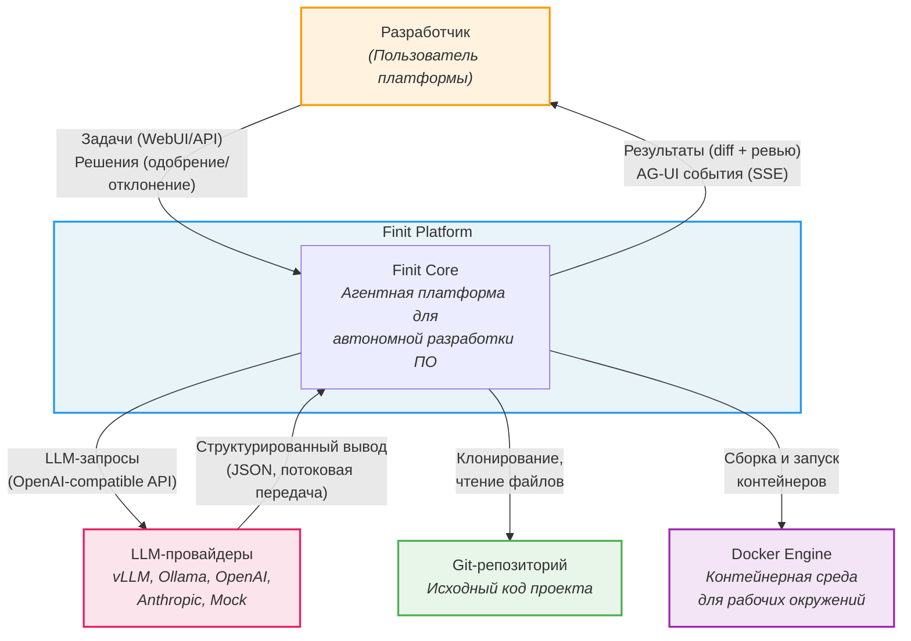

# C4 Context -- Finit Platform

Верхний уровень: система, пользователь, внешние сервисы и границы.

## Границы системы

| Элемент | Внутри системы | Вне системы |
|---|---|---|
| **Управление задачами** | Оркестратор управляет жизненным циклом | Пользователь одобряет/отклоняет |
| **LLM-вывод** | LLM Router маршрутизирует и отслеживает | Вычисления на внешних провайдерах |
| **Исполнение кода** | Агенты вызывают MCP-инструменты в окружениях | Docker Engine управляет контейнерами |
| **Хранение кода** | Docker volumes внутри платформы | Git-репозиторий -- внешний источник |
| **Наблюдаемость** | OTel, Prometheus, Grafana, MLFlow | Grafana/MLFlow -- отдельные процессы |
