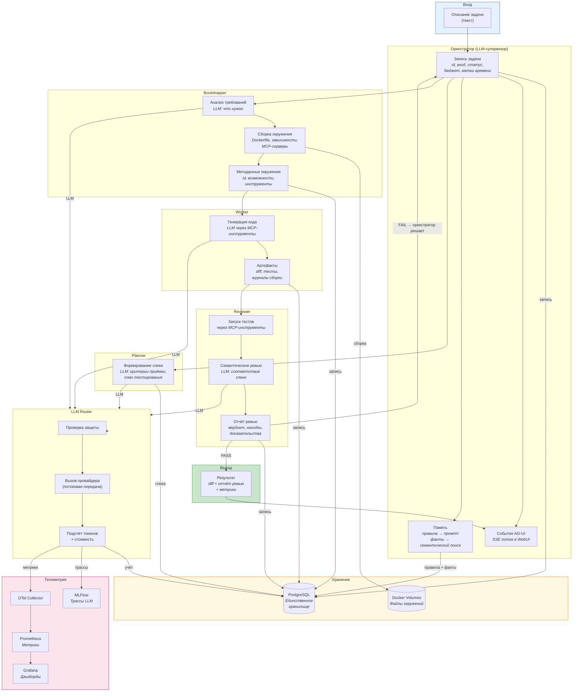
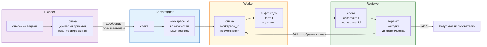

# Поток данных -- Finit Platform

Как данные проходят через систему: что хранится, что логируется, что передаётся.

## Сквозной поток данных

## Что хранится где

| Данные | Куда | Формат | Хранение |
|---|---|---|---|
| Задачи (id, статус, вход, результат) | PostgreSQL | Реляционная схема | Постоянно |
| Спецификации задач (критерии, план тестов) | PostgreSQL | Реляционная схема | Постоянно |
| Артефакты (диффы, результаты тестов) | PostgreSQL | Реляционная схема | Постоянно |
| Отчёты ревью (вердикт, находки) | PostgreSQL | Реляционная схема | Постоянно |
| Решения супервизора | PostgreSQL | Реляционная схема | Постоянно |
| Метаданные окружений (возможности, Dockerfile) | PostgreSQL | JSONB | Постоянно |
| Конфигурация LLM-провайдеров (адреса, цены) | PostgreSQL | JSONB | Постоянно |
| Карточки агентов (A2A) | PostgreSQL | JSONB | Постоянно |
| Учёт токенов по запросам | PostgreSQL | Строки | Постоянно |
| Секреты (зашифрованные) | PostgreSQL | Зашифрованные | Постоянно |
| Правила (принудительная память) | PostgreSQL | Текст | Постоянно |
| Факты (индексируемая память) | PostgreSQL + pgvector | Текст + вектор | Постоянно |
| События AG-UI | PostgreSQL | JSONB | Постоянно |
| Журнал аудита | PostgreSQL | JSONB | Постоянно |
| Файлы окружений (код, зависимости, инструменты) | Docker Volume | Файлы | Время жизни окружения |
| Трассы OTel | OTel Collector → stdout | OTLP | Настраиваемо |
| Метрики Prometheus | Prometheus TSDB | Метрики | 15 дней |
| Трассы LLM-вызовов (промпт, ответ) | MLFlow | Артефакты | Постоянно |

**PostgreSQL -- единственное хранилище всех данных платформы.**

## Что логируется

| Событие | Уровень | Содержит | Не содержит |
|---|---|---|---|
| Создание задачи | INFO | task_id, краткое описание | Полный текст |
| Вызов A2A | INFO | агент, метод, task_id, trace_id | Содержимое |
| LLM-запрос | INFO | модель, провайдер, токены, стоимость, задержка | Промпт/ответ (опция) |
| LLM-запрос (отладка) | DEBUG | Полный промпт и ответ | Секреты (замаскированы) |
| Блокировка защитой | WARN | тип (инъекция/секрет), agent_id, task_id | Заблокированное содержимое |
| Изменение состояния агента | WARN | agent_id, старый/новый статус | - |
| Изменение состояния провайдера | WARN | provider_id, старый/новый статус | - |
| Переход состояния задачи | INFO | task_id, старый/новый статус | - |
| Ошибка авторизации | WARN | agent_id, endpoint, причина | Значение токена |
| Исчерпание бюджета | WARN | task_id, agent_id, потрачено, лимит | - |
| Сохранение правила/факта | INFO | scope, автор, тип | Содержимое (отладка) |

## Потоки данных между агентами

Потоки динамические -- оркестратор решает через LLM, кому и что передать. Типичные маршруты:

Это типичный маршрут, не фиксированный пайплайн. Оркестратор может вызвать bootstrapper повторно по запросу worker-а (`input_required`), или вернуть запрос planner-у для уточнения спеки.
