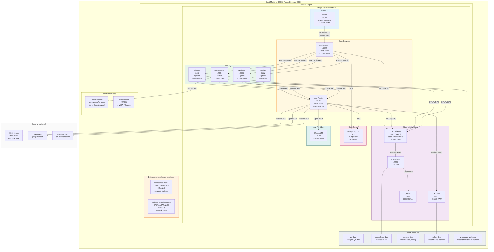

# Диаграмма деплоя

Физическое размещение компонентов на инфраструктуре.

## Single-Machine Deployment (MVP)



## Требования к ресурсам

### Распределение RAM (минимальная конфигурация, 16GB)

| Группа | Сервисы | RAM |
|---|---|---|
| Core | Orchestrator + LLM Router | ~1 GB |
| Agents | Planner + Bootstrapper + Worker + Reviewer | ~2.5 GB |
| Data | PostgreSQL | ~2 GB |
| Observability | OTel + Prometheus + Grafana + MLFlow | ~2 GB |
| Sandboxes | 1 worker sandbox + 1 review sandbox | ~6 GB |
| OS + Docker | Overhead | ~2.5 GB |
| **Total** | | **~16 GB** |

### Распределение портов

| Диапазон | Назначение | Доступ |
|---|---|---|
| 3000 | WebUI | Пользователь (браузер) |
| 3001 | Grafana | Оператор |
| 5000 | MLFlow | Оператор |
| 8080-8081 | Core Services (Orch, Router) | Internal + API clients |
| 9000-9003 | A2A Agents | Internal only |
| 4317, 8889, 9090 | Observability (OTel, Prometheus) | Internal only |
| 5432 | PostgreSQL | Internal only |

### Сетевая изоляция

```
finit-net (bridge):
  ├── Все platform-сервисы (Orch, Router, Agents, PG, Observability, WebUI)
  └── Могут общаться между собой

workspace-isolated-{task-id} (bridge, no external):
  └── Worker sandbox — доступ только к MCP-серверам внутри контейнера

workspace-review-{task-id} (none):
  └── Reviewer sandbox — без сетевого доступа
```

## Production Deployment (Firecracker)

В production-конфигурации ephemeral sandboxes заменяются на Firecracker microVM:

```
Host Machine
  ├── Docker Engine (platform services)  — без изменений
  └── Firecracker VMM
       ├── microVM: workspace-task-1     — выделенное ядро, KVM изоляция
       └── microVM: workspace-review-1   — read-only rootfs, без сети
```

Преимущества Firecracker:
- Boot time < 150ms (vs Docker ~500ms)
- Полная VM-изоляция через KVM (vs namespace isolation)
- Выделенное ядро — нет shared kernel attack surface
- Минимальный overhead (~5MB RAM per VM)
