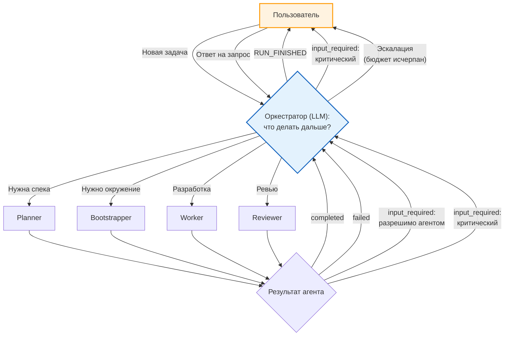
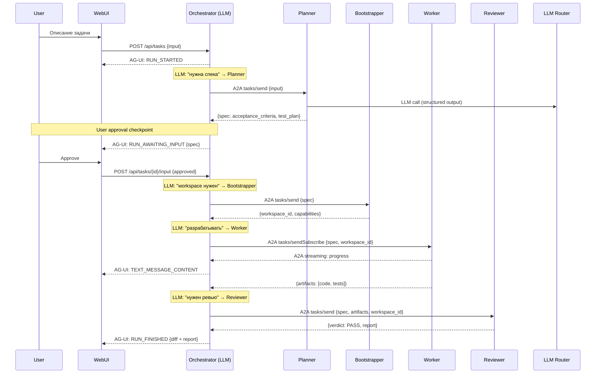
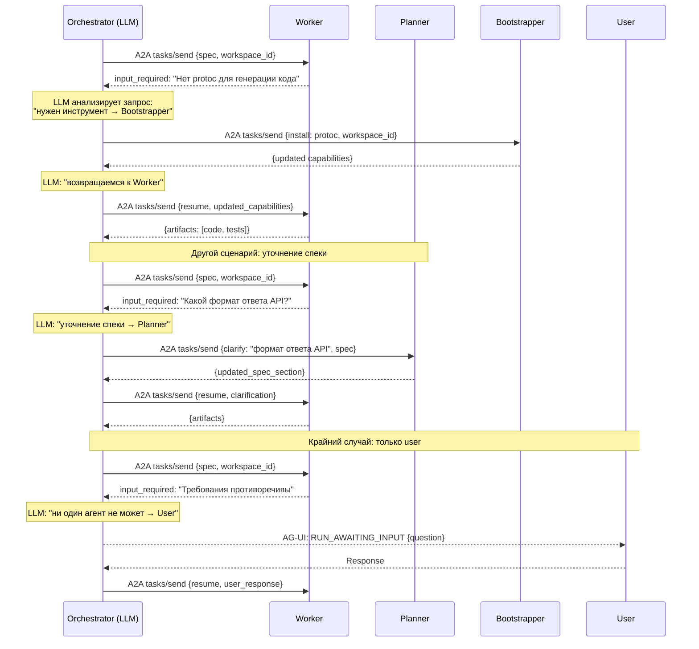
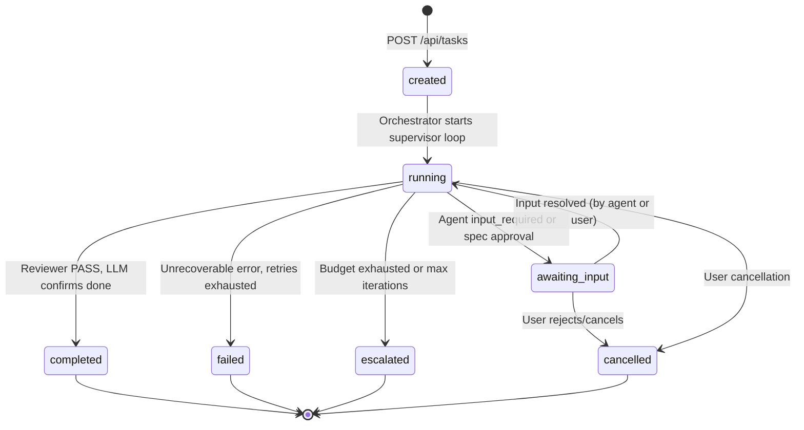
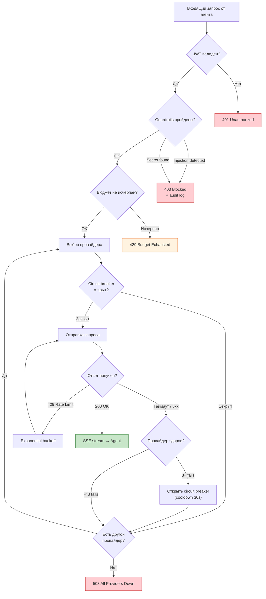

# Workflow -- Выполнение задачи

Динамический workflow с LLM-driven маршрутизацией и разрешением `input_required`.

## Supervisor loop (основной цикл оркестратора)

## Happy path (sequence)

## Dynamic routing: Worker `input_required`

## Task state machine

Состояние `running` включает все внутренние фазы (planning, bootstrapping, working, reviewing). Оркестратор динамически переключается между ними внутри supervisor loop. Это не фиксированные переходы -- LLM решает.

## Обработка ошибок LLM Router

